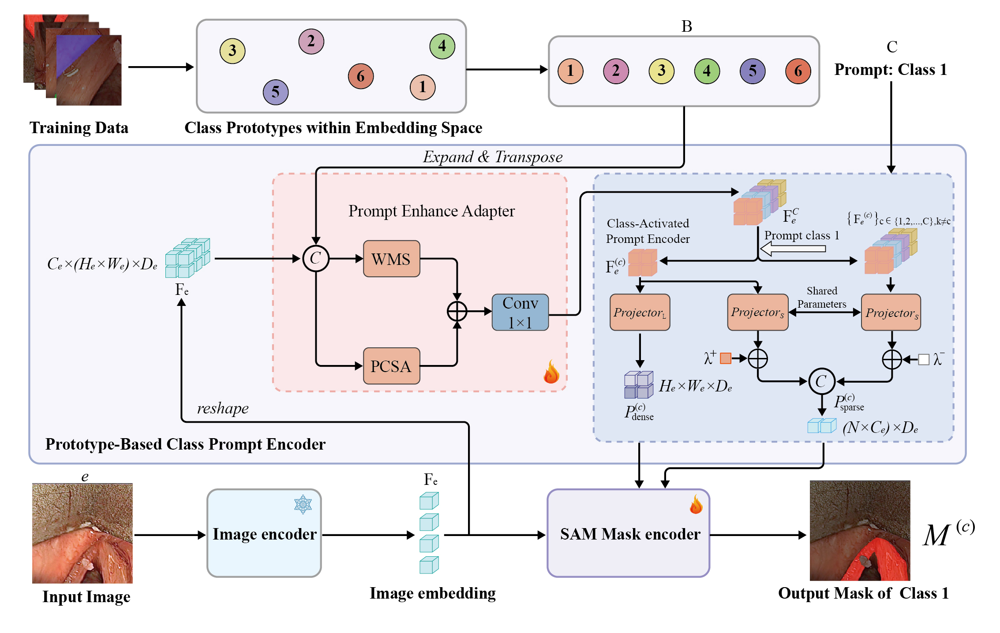

## Abstract 
Medical endoscopic image segmentation is crucial for clinical
diagnosis. However, existing methods face significant challenges due to
domain heterogeneity and prompt dependency constraints. In particular,
small target segmentation and complex background noise remain major
obstacles. Moreover, pre-trained models struggle to adapt to medical sce-
narios due to domain heterogeneity, which limits their ability to handle
diverse endoscopic images with small targets and complex backgrounds,
while their reliance on high-quality prompts further constrains perfor-
mance in medical applications. To address these, we propose MedEn-
doSAM, a novel framework for medical endoscopic segmentation. It inte-
grates a prompt enhance adapter to optimize class prompt interactions,
weighted multi-scale linear attention to suppress background noise and
enhance target features, and partial convolution and spatial attention to
capture multi-scale context for improved robustness. Furthermore, the
class-activated prompt encoder adaptively learns category-specific fea-
tures, reducing dependency on manual prompts. Extensive experiments
on the VocalFolds and EndoVis2018 datasets demonstrate that MedEn-
doSAM achieves state-of-the-art performance across multiple metrics
with a small number of parameters. It improves segmentation accuracy
for endoscopic images and significantly enhances robustness in complex
backgrounds, outperforming existing methods.

## Clone Repository
1. Clone the repository.
``` shell
git clone https://github.com/ZHENGER001/MedEndoSAM.git
cd MedEndoSAM/
```
2. Create a virtual environment for SurgicalSAM and activate the environment.
```shell
conda create -n MedEndoSAM python=3.10
conda activate MedEndoSAM
pip install -r requirements.txt
```
## Data
We use the [EndoVis2018](https://endovissub2018-roboticscenesegmentation.grand-challenge.org/) [1] and [vocalfolds](https://github.com/imesluh/vocalfolds) [2] datasets in our experiments. 
For training, we perform data augmentation and pre-compute the SAM features of the training data beforehand. The process is as follows:
```
cd Medendosam/tools/
python data_preprocess.py
```
## Checkpoints

In MedEndoSAM, the vit_h model is utilized.

Please find the checkpoint of SAM in `vit_h` version [here](https://dl.fbaipublicfiles.com/segment_anything/sam_vit_h_4b8939.pth). 

##  File Organisation
the files should be organised as follows.
 ```tree
MedEndoSAM
    |__figure
    |    ...
    |__data
    |    |__endovis_2018
    |    |    |__train
    |    |    |   |__0
    |    |    |   |  |__binary_annotations
    |    |    |   |  |     ...
    |    |    |   |  |__class_embeddings_h
    |    |    |   |  |     ...
    |    |    |   |  |__images
    |    |    |   |  |     ...
    |    |    |   |  |__sam_features_h
    |    |    |   |       ...
    |    |    |   |__1
    |    |    |   |  ...
    |    |    |   |__2
    |    |    |   |  ...
    |    |    |   |__3
    |    |    |   |  ...
    |    |    |   |__...
    |    |    |__val
    |    |        |__annotations
    |    |        |     ...
    |    |        |__binary_annotations
    |    |        |     ...
    |    |        |__class_embeddings_h
    |    |        |     ...
    |    |        |__sam_features_h
    |    |              ...
    |    |__vocalfolds
    |    |    |__train
    |    |    |   |__0
    |    |    |   |  |__binary_annotations
    |    |    |   |  |     ...
    |    |    |   |  |__class_embeddings_h
    |    |    |   |  |     ...
    |    |    |   |  |__images
    |    |    |   |  |     ...
    |    |    |   |  |__sam_features_h
    |    |    |   |       ...
    |    |    |   |__1
    |    |    |   |  ...
    |    |    |   |__2
    |    |    |   |  ...
    |    |    |   |__3
    |    |    |   |  ...
    |    |    |   |__...
    |    |    |__val
    |    |        |__annotations
    |    |        |     ...
    |    |        |__binary_annotations
    |    |        |     ...
    |    |        |__class_embeddings_h
    |    |        |     ...
    |    |        |__sam_features_h
    |    |              ...
    |__Medendosam
    |   ...
    |      
    | 
    |   
    |   
    |__ckp
    |    |__sam
    |    |   |__sam_vit_h_4b8939.pth
    |    |
    |    |__medendosam
    |            |__endovis_2018
    |            |     ...
    |            |__vocalfolds
    |                    ...
    |   
    |__segment_anything
    |    ...
 ```
##  Train
To train the model:
```
cd Medendosam/
python train.py  --dataset endovis_2018
python train.py  --dataset vocalfolds
```

##  Inference
```
cd Medendosam/
python inference.py  --dataset endovis_2018
python inference.py  --dataset vocalfolds
